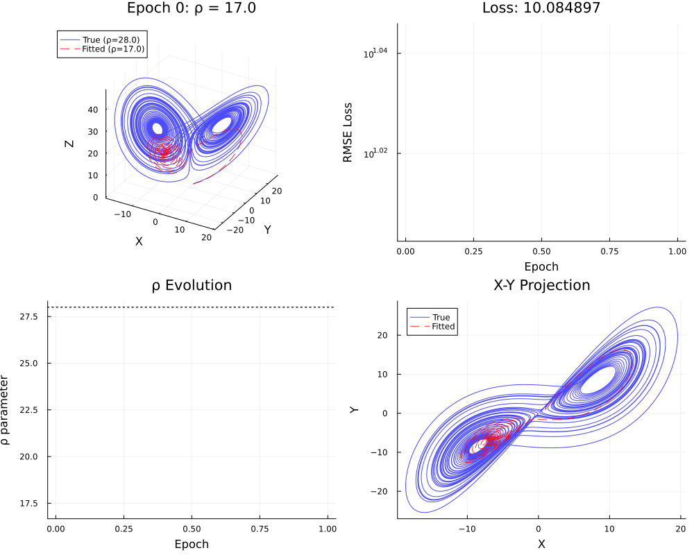

# LorenzParameterEstimation.jl

[](https://opensource.org/licenses/MIT)
[](https://julialang.org)
[](https://doi.org/10.5281/zenodo.19052322)



A Julia package for gradient-based parameter estimation in the Lorenz-63 chaotic dynamical system. Developed as part of a master thesis on gradient-based calibration of atmospheric models, this package serves as a methodological testbed for evaluating windowed-loss training strategies and automatic differentiation through chaotic ODE integrators, prior to application in a full general circulation model.

## Background

The Lorenz-63 system,

$$
\begin{aligned}
\dot{x} &= \sigma(y - x) \\
\dot{y} &= x(\rho - z) - y \\
\dot{z} &= xy - \beta z
\end{aligned}
$$

exhibits sensitive dependence on initial conditions. With Lyapunov exponent λ ≈ 0.9, trajectory errors grow as $e^{\lambda t}$, making the standard approach of differentiating through a full trajectory numerically intractable for parameter estimation: gradients become dominated by chaotic divergence rather than by the parameter signal. This package addresses that problem through two complementary approaches.

## Estimation Approaches

### Weather approach — windowed trajectory loss

The trajectory-based approach applies **teacher forcing with short integration windows**. Rather than integrating from a fixed initial condition and computing loss against the full observed trajectory, the loss is accumulated over many short windows, each restarted from the corresponding observed state:

```julia
loss = 0
for window_start in 1:stride:N-window_size
    u0 = observed[window_start]          # restart from observation (teacher forcing)
    predicted = integrate(params, u0, window_size * dt, dt)
    loss += distance(predicted, observed[window_start:window_start+window_size])
end
```

Each window spans approximately one to two Lyapunov times, limiting exponential error growth and producing well-conditioned gradients. Gradients are computed via [Enzyme.jl](https://github.com/EnzymeAD/Enzyme.jl) automatic differentiation through the fourth-order Runge-Kutta integrator.

### Climate approach — statistical loss

The statistical approach makes no assumption about trajectory alignment. Instead of comparing pointwise states, it matches long-run statistics of the simulated and observed attractor: mean, standard deviation, marginal probability densities, and Wasserstein distance between empirical distributions. This is appropriate when observations are not time-synchronised with the model, or when the quantity of interest is the invariant measure rather than any individual trajectory.

## Package Structure

```text
src/
  LorenzParameterEstimation.jl   # module entry point, exports
  types.jl                        # L63Parameters{T}, L63System{T}, L63Solution{T},
                                  #   L63TrainingConfig{T}, OptimizerConfig
  integration.jl                  # lorenz_rhs(), rk4_step(), integrate()
  loss.jl                         # windowed loss functions, compute_gradients_modular()
  training.jl                     # modular_train!() (modern), train!() (legacy)
  training_climate.jl             # train_statistics(), statistical loss functions
  optimizers.jl                   # adam_config(), sgd_config(), adamw_config(), ...
  utils.jl                        # classic_params(), parameter_error(), noise utilities
  visualization.jl                # plotting interface (loaded via extension)
ext/
  LorenzVisualizationExt.jl       # Plots/Images/FileIO extension
test/
  runtests.jl                     # test runner
  test_types.jl                   # type construction and arithmetic
  test_integration.jl             # RK4 correctness and chaotic behaviour
  test_loss.jl                    # loss functions and gradient validation
  test_optimizers.jl              # optimizer configuration
  test_training.jl                # training API coverage
  test_utils.jl                   # parameter utilities
  test_integration_e2e.jl         # end-to-end workflows
  test_code_quality.jl            # Aqua.jl checks, type stability
  benchmarks.jl                   # performance benchmarks
examples_weather/                 # trajectory-based experiments (Jupyter notebooks)
examples_climate/                 # statistics-based experiments (Jupyter notebooks)
```

## Installation

```julia
using Pkg
Pkg.add(url="https://github.com/nviebig/LorenzParameterEstimation")
```

For development:

```julia
Pkg.develop(path="path/to/LorenzParameterEstimation")
```

Requires Julia ≥ 1.9.

## Usage

### Modern API

```julia
using LorenzParameterEstimation

# Reference trajectory from known parameters
true_params = L63Parameters(σ=10.0, ρ=28.0, β=8.0/3.0)
target = integrate(true_params, [1.0, 1.0, 1.0], (0.0, 10.0), 0.01)

# Estimate ρ from trajectory data
guess = L63Parameters(σ=10.0, ρ=20.0, β=8.0/3.0)

result = modular_train!(
    guess, target;
    optimizer_config       = adam_config(learning_rate=0.01),
    loss_function          = window_rmse,
    epochs                 = 200,
    window_size            = 100,
    update_σ               = false,
    update_ρ               = true,
    update_β               = false,
    early_stopping_patience = 25,
    verbose                = true
)

println(result.best_params)
```

### Legacy API

```julia
config = L63TrainingConfig(
    epochs      = 100,
    η           = 5e-3,
    window_size = 300,
    update_ρ    = true,
    update_σ    = false,
    update_β    = false
)

best_params, loss_history, param_history = train!(guess, target, config)
```

### Optimizer configuration

```julia
# Pre-configured optimizers
adam_config(learning_rate=0.001, gradient_clip_norm=1.0)
sgd_config(learning_rate=0.01, momentum=0.9)
adagrad_config(learning_rate=0.1)
adamw_config(learning_rate=0.001, weight_decay=1e-2)

# Convenience presets
robust_optimizer()   # AdamW, conservative settings
fast_optimizer()     # Adam, higher learning rate

# Custom Optimisers.jl chain
using Optimisers
chain = Optimisers.OptimiserChain(
    Optimisers.ClipNorm(1.0),
    Optimisers.Adam(0.01, (0.9, 0.999))
)
config = OptimizerConfig(chain, 0.01, name="Adam+ClipNorm")
```

### Loss functions

```julia
# Trajectory-based (weather approach)
window_rmse          # root mean squared error over window
window_mae           # mean absolute error, more robust to outliers
adaptive_loss        # Huber-type, interpolates between L1 and L2

# Statistical (climate approach) — see training_climate.jl
train_statistics(params, target; loss=:wasserstein)
train_statistics(params, target; loss=:pdf)
train_statistics(params, target; loss=:mean)
```

### Gradient computation

```julia
loss_value, gradients = compute_gradients_modular(
    params, target, window_start, window_size, loss_function
)
```

## Examples

Jupyter notebooks for both approaches are in `examples_weather/` and `examples_climate/`.

**Weather approach:**

- `examples_weather/basic_training/l63_training_rho.ipynb` — single-parameter recovery with gradient diagnostics
- `examples_weather/basic_training/l63_training all.ipynb` — simultaneous recovery of σ, ρ, β
- `examples_weather/walkthrough/modular_train_walkthrough.ipynb` — step-by-step walkthrough of the modern API

**Climate approach:**

- `examples_climate/mean/train_mean.ipynb` — mean-statistics matching
- `examples_climate/pdf/` — PDF and Wasserstein-distance approaches

## Key Types

| Type | Description |
| --- | --- |
| `L63Parameters{T}` | Parameter container (σ, ρ, β) with arithmetic operations for gradient updates |
| `L63System{T}` | Complete system specification (parameters, initial condition, time span, step size) |
| `L63Solution{T}` | Integration output with trajectory array and time vector |
| `OptimizerConfig` | Optimizer and hyperparameter bundle for `modular_train!` |

## Design Notes

**Enzyme.jl over ForwardDiff/Zygote.** Enzyme differentiates through the RK4 loop at the LLVM level, producing exact derivatives without tape overhead. This is necessary for the performance requirements of windowed training over long trajectories. A technical constraint is that functions passed to `Enzyme.gradient` must be defined at module scope, not as closures.

**Two APIs.** `modular_train!` is the recommended interface: it supports early stopping, configurable loss functions, and returns structured results. `train!` with `L63TrainingConfig` is retained for reproducibility of earlier experiments.

**Extension-based visualization.** The core package has no plotting dependency. When `Plots.jl` is loaded, `LorenzVisualizationExt` is activated automatically.

## Citation

This package is developed as part of a master thesis on gradient-based calibration of atmospheric models.

[](https://doi.org/10.5281/zenodo.19052322)

```bibtex
@software{viebig2025lorenzparameterestimation,
  author    = {Viebig, Niklas},
  title     = {{LorenzParameterEstimation.jl}: Parameter Estimation
               for the {Lorenz-63} Chaotic System via Automatic
               Differentiation},
  year      = {2025},
  publisher = {Zenodo},
  version   = {v0.1.0},
  doi       = {10.5281/zenodo.19052322},
  url       = {https://doi.org/10.5281/zenodo.19052322}
}
```

## Related Work

- [Enzyme.jl](https://github.com/EnzymeAD/Enzyme.jl) — source-level automatic differentiation for Julia
- [Optimisers.jl](https://github.com/FluxML/Optimisers.jl) — gradient-based optimizers
- [DifferentialEquations.jl](https://github.com/SciML/DifferentialEquations.jl) — ODE solvers
- [SpeedyWeather.jl](https://github.com/SpeedyWeather/SpeedyWeather.jl) — atmospheric model for which this methodology is developed

## License

MIT License. See [LICENSE](LICENSE).
